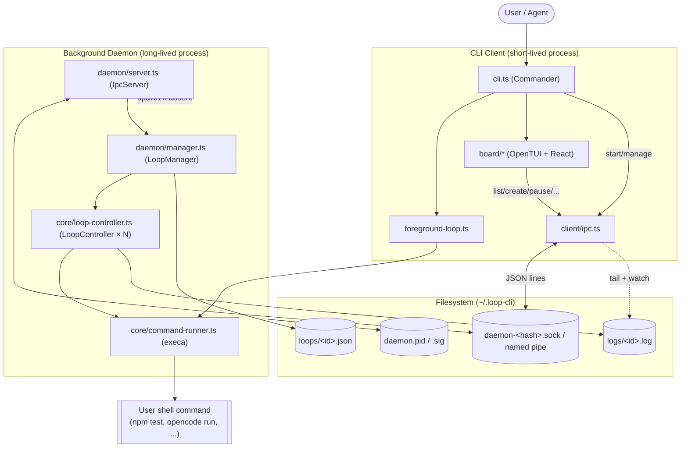
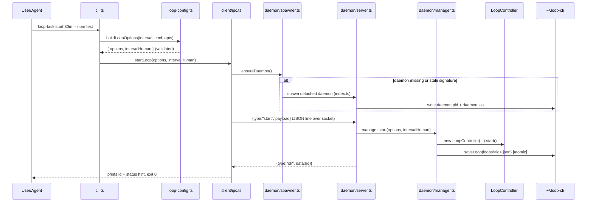

# Architecture

> Generated architecture reference for **loop-task** (repo: `loop-cli`).
> Rerun `/ob-create-architecture` whenever the architecture changes significantly.

## Architecture Overview

**loop-task** is a cross-platform command-line tool that repeatedly runs a shell
command at a human-readable interval (`30s`, `5m`, `1h`, `1d`, `1w`). It is built
for developers and automation/agent workflows that need lightweight, persistent,
recurring command execution without a full scheduler like cron.

The system uses a **client–daemon architecture** communicating over a **local IPC
transport** (Unix domain socket on POSIX, named pipe on Windows):

- A short-lived **CLI client** parses arguments and either runs a loop in the
  foreground or talks to a background daemon.
- A long-lived **background daemon** owns all managed loops, persists their state
  to disk, and streams their output to connected clients.
- An interactive **terminal UI board** (OpenTUI + React) is the primary way to
  create, inspect, and manage loops, driving the daemon entirely over IPC.

The architecture is deliberately **filesystem-backed and serverless** (no network
services, no database): all state lives under `~/.loop-cli`. The build step compiles
TypeScript to `dist/` for npm distribution; the board requires Bun for OpenTUI native FFI.

Major architectural style: **multi-process, event-driven, message-passing** (JSON
lines over a socket), with a state-machine core per loop.

---

## 1. Project Structure

```text
loop-cli/
├── src/
│   ├── cli.ts                  # Commander entry point (Node shebang); routes start/run/board
│   ├── entry.js                # Node entry wrapper (registers ESM loader, imports cli.js)
│   ├── esm-loader.js           # Custom Node ESM loader (fixes upstream extensionless imports)
│   ├── types.ts                # Shared domain + IPC message types (LoopOptions, LoopMeta, IpcRequest/Response)
│   ├── duration.ts             # Parse/format human intervals (uses `ms`)
│   ├── logger.ts               # Foreground logger (verbose/info/error)
│   ├── loop-config.ts          # buildLoopOptions, parseCommandLine, parseMaxRuns (validation)
│   │
│   ├── core/                   # Runtime-agnostic loop execution
│   │   ├── loop-controller.ts  # LoopController: per-loop state machine (EventEmitter)
│   │   ├── command-runner.ts   # executeCommand / executeCommandForeground (execa)
│   │   ├── foreground-loop.ts  # runLoop: blocking foreground loop for `run`
│   │   └── log-rotator.ts      # Size-based log rotation (1 MB × 3 generations)
│   │
│   ├── daemon/                 # Background server process
│   │   ├── index.ts            # Daemon entry: bind socket → init manager → handle signals
│   │   ├── server.ts           # IpcServer: net server, JSON-lines protocol, request routing
│   │   ├── manager.ts          # LoopManager: owns LoopControllers, persistence, lifecycle
│   │   ├── spawner.ts          # ensureDaemon: spawn/restart daemon, code-signature check
│   │   ├── state.ts            # Loop + daemon state persistence, PID/signature, code signature
│   │   └── daemon-log.ts       # Daemon-side diagnostic log
│   │
│   ├── client/                 # CLI-side IPC consumer
│   │   ├── ipc.ts              # sendRequest / streamRequest (connect, timeout, framing)
│   │   └── commands.ts         # CLI output formatters (start/list/status/pause/.../logs/attach)
│   │
│   ├── ipc/                    # Shared IPC primitives (server-side)
│   │   ├── send.ts             # send(): write a JSON line to a socket
│   │   └── handlers/
│   │       └── logs-stream.ts  # streamLogFollow: tail + fs.watch live log streaming
│   │
│   ├── board/                  # Interactive TUI (OpenTUI + React 19)
│   │   ├── index.tsx           # launchBoard: createCliRenderer + React root
│   │   ├── App.tsx             # Top-level board container + state orchestration
│   │   ├── daemon.ts           # Board→daemon bridge (typed IPC calls)
│   │   ├── state.ts            # Filters/sort logic (applyLoopFilters, cycles)
│   │   ├── format.ts           # Display formatters (statusColor, timing, truncate)
│   │   ├── toast.tsx           # Toast notifications
│   │   ├── types.ts            # View/Mode/ConfirmState/DaemonStatus
│   │   ├── components/         # Header, FilterBar, Navigator, Inspector, Timeline,
│   │   │                       #   DetailView, CreateForm, ConfirmModal, HelpModal, Footer
│   │   └── hooks/              # useLoopPolling, useLogStream, useBoardKeybindings
│   │
│   ├── config/
│   │   ├── constants.ts        # Magic numbers (POLL_MS, timeouts, log limits)
│   │   └── paths.ts            # Data dir + socket/pid/loop/log path resolution
│   │
│   ├── i18n/
│   │   ├── index.ts            # t(key, params) translator with typed key union
│   │   └── en.json             # All user-facing strings (231 keys)
│   │
│   └── shared/                 # Small utilities
│       ├── sleep.ts            # Abortable sleep
│       ├── tail.ts             # Last-N-lines extraction
│       └── fs-utils.ts         # writeFileAtomic, removeIfExists
│
├── tests/                      # Vitest suite (unit + CLI integration)
├── openspec/                   # OpenSpec change/spec workflow (specs currently empty)
├── .opencode/                  # OpenCode agent configuration (agents, MCP, plugins)
├── .agents/                    # Agent skills + source-roots.json
├── package.json                # Scripts, deps, bin entry (loop-task → dist/entry.js)
├── tsconfig.json               # Strict ESM, jsxImportSource @opentui/react
├── vitest.config.ts            # Coverage config (90% thresholds)
├── eslint.config.js            # typescript-eslint recommended
├── README.md / AGENTS.md       # Usage docs / agent operating guide
└── DESIGN.md / ARCHITECTURE.md # Design + architecture docs (this file)
```

---

## 2. High-Level System Diagram



---

## 3. Core Components

### 3.1 Frontend / User Interface - Board TUI

- **Responsibility:** Primary interactive surface for browsing, creating, editing,
  pausing/resuming, force-running, deleting, searching, filtering, and sorting
  loops, plus live output streaming.
- **Key files:** `src/board/index.tsx` (renderer bootstrap), `src/board/App.tsx`
  (state orchestration), `src/board/components/*` (UI panels and modals),
  `src/board/hooks/*` (polling, log streaming, keybindings),
  `src/board/daemon.ts` (typed IPC bridge), `src/board/state.ts`,
  `src/board/format.ts`.
  - **Technologies:** OpenTUI (`@opentui/core`, `@opentui/react` 0.4.x), React 19,
  Bun (native FFI). JSX renders to terminal renderables (`<box>`, `<text>`, `<scrollbox>`,
  `<input>`, `<select>`).
- **Inputs:** Keyboard events (`useBoardKeybindings`), mouse `onMouseDown` on
  actionable boxes (Navigator rows, Save/Cancel, Yes/No), daemon poll data.
- **Outputs:** IPC requests to the daemon; rendered terminal frames; toasts.
- **Notable patterns:** Loop list is polled every `POLL_MS` (2s) via
  `useLoopPolling`; live logs streamed via `useLogStream` over a follow socket;
  destructive/schedule-changing actions go through a confirmation modal.

### 3.2 Backend / Server - Daemon

- **Responsibility:** Single background process that owns every managed loop,
  persists state, restarts persisted loops on boot, and serves clients.
- **Key files:** `src/daemon/index.ts`, `src/daemon/server.ts` (`IpcServer`),
  `src/daemon/manager.ts` (`LoopManager`), `src/daemon/state.ts`,
  `src/daemon/spawner.ts`.
- **Technologies:** Node `net` server, `child_process` (daemon spawn),
  filesystem persistence.
- **Inputs:** Newline-delimited JSON `IpcRequest` messages
  (`start`, `update`, `list`, `status`, `pause`, `resume`, `trigger`,
  `delete`, `attach`, `logs`, `shutdown`).
- **Outputs:** `IpcResponse` messages (`ok`/`error`/`data`/`end`); persisted
  `loops/<id>.json`; per-loop `logs/<id>.log`.
- **Lifecycle highlights:**
  - **Single-flight guard:** `IpcServer.listen()` binds the socket *before*
    `manager.init()`; a losing racer fails to bind and `index.ts` exits `0`
    cleanly (`daemon/index.ts:19-22`).
  - **Auto-spawn + auto-restart:** `ensureDaemon()` (`spawner.ts`) starts the
    daemon on demand and restarts it when the source **code signature** changes
    (so a freshly edited CLI never talks to a stale daemon).
  - **Persistence-driven restart:** on boot, `LoopManager.init()` reloads
    non-stopped loops and resumes their controllers.

### 3.3 Shared Libraries / Common Code

- **`src/core/` (loop engine):** `LoopController` is an `EventEmitter`-based state
  machine (`running`/`waiting`/`paused`/`stopped`) handling intervals, immediate
  runs, pause/resume, force-run, max-runs, and abortable sleeps in `SLEEP_CHUNK_MS`
  slices. `command-runner.ts` wraps `execa`. `log-rotator.ts` does size-based
  rotation. Used by both the daemon and the foreground runner.
- **`src/types.ts`:** Canonical domain model (`LoopOptions`, `LoopMeta`,
  `LoopStatus`) and the IPC contract (`IpcRequest`/`IpcResponse` discriminated
  unions) shared across client and daemon.
- **`src/config/`:** `constants.ts` centralizes all magic numbers;
  `paths.ts` resolves the data dir (honoring `LOOP_CLI_HOME`) and computes the
  platform-specific socket path.
- **`src/i18n/`:** `t(key, params)` with a typed key union over `en.json`; all
  user-facing strings are centralized (231 keys).
- **`src/shared/`:** `sleep` (abortable), `tail` (last-N-lines),
  `fs-utils` (`writeFileAtomic`, `removeIfExists`).

### 3.4 CLI / Scripts / Automation

- **Responsibility:** Argument parsing and the three execution modes.
- **Key file:** `src/cli.ts` (Commander v13). Entry registered as the `loop-task`
  bin pointing at `dist/entry.js` (Node shebang, build step compiles TS to JS).
- **Modes:**
  - `loop-task` (default) → `launchBoard()` (TUI).
  - `loop-task start` → spawns/restores the background daemon.
  - `loop-task new <interval> -- <cmd>` → `startLoop()` → background loop.
  - `loop-task run <interval> -- <cmd>` → `runLoop()` → foreground, blocking,
    Ctrl+C-aware.
  - `loop-task project list|new|rename|color|delete` → project management over
    the daemon RPC (`client/commands.ts` project handlers).
- **Inputs:** `<interval>`, `<command...>`, options `--now`, `--max-runs`,
  `--verbose`, `--cwd`, `--project <name|id>`. `--` stops loop-task option parsing
  so the target command keeps its own flags. Project names resolve to ids via
  `resolveProjectId` (exact id, then case-insensitive name); colors resolve via
  `resolveColor` (named palette or `#rrggbb`).
- **Outputs:** Console summaries (via `client/commands.ts`) or the rendered board.

---

## 4. Data Flow

### 4.1 `start` - create a background loop



### 4.2 Board runtime loop (poll + live logs)

```mermaid
sequenceDiagram
    participant B as board/App.tsx
    participant H as useLoopPolling
    participant D as board/daemon.ts
    participant S as daemon/server.ts
    participant LS as ipc/handlers/logs-stream.ts
    participant FS as logs/<id>.log

    loop every POLL_MS (2s)
        H->>D: listLoops()
        D->>S: {type:"list"}
        S-->>D: {type:"ok", data:[LoopMeta]}
        D-->>H: LoopMeta[] (diffed; re-render only on change)
    end
    B->>S: {type:"logs", follow:true} (selected loop)
    S->>LS: streamLogFollow(logPath, socket, tail)
    LS->>FS: read tail window, then fs.watch
    LS-->>B: {type:"data", line} per new line
    Note over B: User action (pause/delete/...) → ConfirmModal → IPC request → refresh()
```

**Foreground (`run`) flow** bypasses the daemon entirely: `cli.ts` builds options,
installs `SIGINT`/`SIGTERM` → `AbortController`, and calls
`core/foreground-loop.ts#runLoop`, which executes with inherited stdio until
max-runs or abort.

---

## 5. Data Stores

All persistence is **local filesystem** under the data directory, resolved by
`src/config/paths.ts#getDataDir()`:
`process.env.LOOP_CLI_HOME` (if set) else `os.homedir()`, joined with `.loop-cli`.

| Store | Path | Purpose | Format / Schema | Lifecycle |
|-------|------|---------|-----------------|-----------|
| **Loop metadata** | `~/.loop-cli/loops.json` | Consolidated loop config + runtime status (single JSON array) | `LoopMeta[]` (`src/types.ts`) | Created/updated on every state change via `writeFileAtomic`; individual loops upserted by id; entries removed on `delete` |
| Loop output | `~/.loop-cli/logs/<id>.log` | Captured stdout/stderr of each run | Plain text with run headers/exit markers | Appended during runs; rotated at `MAX_LOG_BYTES` (1 MB) keeping `MAX_LOG_GENERATIONS` (3) `.1/.2/.3` files; deleted on `delete` |
| Daemon PID | `~/.loop-cli/daemon.pid` | Liveness/single-instance tracking | Integer PID | Written on daemon boot; removed on shutdown |
| Code signature | `~/.loop-cli/daemon.sig` | Detect stale daemon vs current source | 16-char SHA-1 over src mtime/size/count | Written on boot; compared by `ensureDaemon` |
| IPC endpoint | POSIX: `~/.loop-cli/daemon-<hash>.sock`; Windows: `\\.\pipe\loop-cli-<user>-<hash>` | Client↔daemon transport | OS socket / named pipe | Bound on boot; `.sock` unlinked on POSIX shutdown |
| Daemon diagnostics | `~/.loop-cli/daemon.log` | Daemon-side troubleshooting log | Plain text | Appended by `daemon-log.ts` |
| **Task definitions** | `~/.loop-cli/tasks.json` | Consolidated task definitions (single JSON array) | `TaskDefinition[]` (`src/types.ts`) | Created/updated on task CRUD via `writeFileAtomic`; entries removed on `delete` |
| **Project metadata** | `~/.loop-cli/projects.json` | Consolidated project config (name, color, system flag) as a single JSON array | `Project[]` (`src/types.ts`) | Created on project CRUD or init (Default); updated atomically on every change; `default` entry is permanent |

**Migration approach:** On daemon init, if `loops.json` does not exist but a `loops/` directory with individual `.json` files does, the contents are consolidated into `loops.json` (old files preserved, not deleted). Same migration applies to `tasks.json` ← `tasks/` and `projects.json` ← `projects/`. Corrupted entries are skipped during migration and load.

### 5.1 Projects

**Projects** are organizational scopes for loops. Every `LoopMeta` carries a `projectId` string (default: `"default"`). The `ProjectManager` class (`src/daemon/projects.ts`) owns project persistence:

- **Default project** - created on first daemon init (`id: "default"`, `isSystem: true`, `isDefault: true`, white). Cannot be renamed or deleted.
- **User projects** - created via `project-create` RPC. Stored in `~/.loop-cli/projects.json` (consolidated array).
- **Migration** - `LoopManager.init()` adds `projectId = "default"` to any loop that lacks the field, then rewrites it atomically. Also migrates individual project files to `projects.json` on first init.
- **Cascade on delete** - when a project is deleted via `project-delete` RPC, all loops with that `projectId` are moved to `"default"` before the project file is removed.
- **Board filtering** - the board keeps `currentProjectId` in React state (persisted to `localStorage`). Only loops matching `loop.projectId === currentProjectId` are shown in the Navigator.

---

## 6. External Integrations / APIs

The application makes **no outbound network calls** and integrates with **no
third-party services**. Its only "integration" is process execution:

| Integration | Method | Config location | Auth | Failure behavior |
|-------------|--------|-----------------|------|------------------|
| User shell command execution | `execa` spawns the target command | Loop's `command`, `commandArgs`, `cwd` (`LoopOptions`) | Runs with the invoking user's privileges (no separate auth) | Non-zero exit is recorded (`lastExitCode`) and the loop **continues**; missing `cwd` skips the run and logs an error rather than crashing (`command-runner.ts:25-30`) |
| Local IPC transport | `net` socket / Windows named pipe | `config/paths.ts#getSocketPath` | None (local-only, OS file/pipe permissions) | Connect errors, closed connections, and `IPC_TIMEOUT_MS` (10s) timeouts reject with localized errors (`client/ipc.ts`) |

Runtime npm dependencies: `@opentui/core`, `@opentui/react`, `commander`,
`execa`, `ms`, `react`.

---

## 7. Key Technologies

| Technology | Role | Architectural relevance |
|------------|------|-------------------------|
| **Bun ≥ 1.2** | Runtime for board (OpenTUI FFI) | Required only for the board; CLI and daemon run under Node |
| **Node ≥ 20** | Primary runtime + package manager host | Executes built JS from `dist/`; npm distribution target |
| **TypeScript (strict, ESM)** | Language | Strict typing of the domain model and IPC contract (`src/types.ts`) as the cross-process source of truth |
| **OpenTUI (`@opentui/core` + `@opentui/react`) 0.4.x** | Terminal UI engine | Enables a React-based board with flex layout, keyboard + mouse events in the terminal |
| **React 19** | UI component model | Declarative board components/hooks; `jsxImportSource: @opentui/react` |
| **Commander 13** | CLI parsing | Defines `start`/`run`/default(board) commands and option handling |
| **execa 9** | Process execution | Spawns user commands with stream capture, cwd, and abort-signal cancellation |
| **ms 2** | Duration parsing | Converts human intervals (`30m`) ↔ milliseconds (`src/duration.ts`) |
| **Node `net` / `child_process` / `fs`** | IPC, daemon spawn, persistence | Underpin the client–daemon architecture and atomic state writes |
| **Vitest 3 + v8 coverage** | Testing | Unit + CLI integration tests with 90% coverage gates |
| **ESLint 9 + typescript-eslint** | Linting | `recommended` ruleset; `no-console` disabled (CLI app) |

---

## 8. Deployment & Infrastructure

- **Build artifacts:** `dist/` compiled from `tsc -p tsconfig.build.json`. `package.json`
  `files: ["dist"]` ships built JS; the `loop-task` bin points at `dist/entry.js`.
  `entry.js` registers the ESM loader (fixes upstream extensionless imports) then
  imports `cli.js`.
- **Distribution:** Published to npm via `npm publish` (`npm run release`;
  dry-run via `release:dry`). Installed globally (`npm install -g loop-task`) or
  run ad hoc (`npx loop-task`).
- **Runtime requirement:** Node ≥ 20 (`engines.node`) for CLI and daemon. Board
  requires Bun for OpenTUI native FFI. Daemon is spawned with `process.execPath`.
- **Environment config:** `LOOP_CLI_HOME` overrides the state directory (used by
  the test suite to isolate daemon state).
- **Containerization:** None - no `Dockerfile` present.
- **CI/CD:** None - `.github/` contains no workflows. Quality gates are run
  manually/locally (`typecheck → lint → test`).
- **Hosting:** N/A - a local developer tool, not a hosted service.

---

## 9. Security Architecture

- **Trust boundary:** The local machine/user. The daemon listens on a
  POSIX Unix-domain socket inside the user's home data dir, or a Windows named
  pipe namespaced to the username (`paths.ts#getSocketPath`). There is **no
  network listener** and **no authentication layer** - access is governed by OS
  file/pipe permissions for that user.
- **Authentication / Authorization:** None within the app (single-user, local).
  *Not applicable by design.*
- **Arbitrary command execution:** Executing user-supplied shell commands is the
  product's explicit purpose; commands run with the invoking user's privileges.
  This is intended, not a vulnerability, but means anyone able to reach the
  socket/pipe can schedule commands as that user.
- **Input validation:** Intervals (`parseDuration`), max-runs (`parseMaxRuns`,
  rejects `< 1`/NaN), command emptiness, and quote balancing
  (`parseCommandLine`) are validated in `loop-config.ts`. The working directory
  is re-checked before every run; a missing `cwd` skips the run and logs an
  error instead of failing the loop.
- **Secrets:** No secret storage or credentials handling is present. Loop
  metadata and logs are plain files in the user's home directory; sensitive
  output written by a command would land in `logs/<id>.log` unencrypted -
  operators should treat that directory accordingly.
- **IPC robustness:** Malformed JSON requests are answered with a localized
  `error` response rather than crashing the server (`server.ts:62-64`).

---

## 10. Monitoring & Observability

- **Loop output logs:** Per-loop `logs/<id>.log` capture stdout/stderr with run
  headers, exit markers, and durations; surfaced live in the board Timeline and
  via CLI `logs`/`attach` streaming.
- **Daemon diagnostics:** `daemon/daemon-log.ts` appends lifecycle events
  (start, shutdown, listen failures, uncaught exceptions, restart counts) to
  `~/.loop-cli/daemon.log`.
- **Foreground logging:** `src/logger.ts` provides verbose/info/error console
  output for `run` mode (timestamps, exit codes, durations, next-run time).
- **Error surfacing in UI:** Board actions report results as toasts;
  log-stream errors are pushed as error toasts.
- **Metrics / tracing / external error reporting:** None. There is no metrics
  endpoint, distributed tracing, or third-party error-reporting integration -
  *Not evident from the repository.*

---

## 11. Performance & Scalability

- **No overlapping executions:** Each `LoopController` awaits command completion
  before scheduling the next interval, preventing pile-ups.
- **Spread scheduling:** Each loop gets a deterministic phase offset computed as
  `hash(loopId) % intervalMs` (`core/scheduling.ts#computePhase`). The first-run
  delay aligns to this phase instead of using raw `interval`. Users can override
  with `--offset <duration>`. Subsequent runs use the existing
  `runStartedAtMs + interval` math — only the initial scheduling is phased.
- **Abortable, chunked sleeps:** Delays are sliced into `SLEEP_CHUNK_MS` (200 ms)
  chunks so pause/resume/trigger/abort stay responsive without busy-waiting
  (`loop-controller.ts#waitForDelay`).
- **Change-diffed polling:** The board polls `list` every 2 s but only re-renders
  when the serialized result changes (`useLoopPolling`); `LoopManager.persist`
  similarly skips writes when serialized metadata is unchanged.
- **Efficient log tailing:** `logs-stream.ts` seeks the last 64 KB window for the
  initial tail instead of reading whole files, then streams incremental bytes via
  `fs.watch`.
- **Log rotation:** Caps disk usage at ~1 MB × 3 generations per loop.
- **Known bottlenecks / limits:**
  - Polling-based board refresh (2 s) means up to ~2 s latency for status changes
    not triggered locally.
  - All loops run in a **single daemon process** (single Node/Bun event loop);
    very many concurrent, output-heavy commands share that process.
  - `fs.watch` semantics vary by platform and can be less reliable on some
    systems; Windows IPC has documented flakiness (see §15).

---

## 12. Development Workflow

```bash
# Install dependencies
npm install

# Quality gates (run in this order)
npm run typecheck     # tsc --noEmit
npm run lint          # eslint src/ tests/
npm run test          # vitest run
npm run build         # tsc -p tsconfig.build.json + copy entry.js/esm-loader.js

# Run locally
npm run dev           # tsx watch src/cli.ts  (auto-reload)
node dist/entry.js    # invoke the built CLI
# or: npm link  →  loop-task

# Coverage / release
npm run test:coverage # v8 coverage
npm run release:dry   # npm publish --dry-run
npm run release       # npm publish
```

- Isolate daemon state during manual testing with `LOOP_CLI_HOME=/tmp/loop-test`.
- CLI surfaces: `new` (background loop), `start` (daemon), `run` (foreground), `project` (project management), default (board TUI).
- The `.opencode/` and `.agents/` directories configure AI-agent tooling
  (agents, skills, MCP servers) and are not part of the shipped package.

---

## 13. Testing Strategy

- **Framework:** Vitest 3 (`globals: true`), v8 coverage. Config in
  `vitest.config.ts`.
- **Location:** `tests/` -
  - `duration.test.ts`, `logger.test.ts`, `board-state.test.ts` (pure logic),
  - `loop.test.ts`, `loop-controller.test.ts` (core loop engine / state machine),
  - `cli.test.ts`, `background-cli.test.ts` (CLI + daemon integration).
- **Coverage gates:** 90% lines/functions/branches/statements, including
  `src/**/*.ts` but **excluding** `src/cli.ts`, `src/types.ts`,
  `src/daemon/index.ts`, and `src/tui/**`.
- **Known gaps / issues (per `AGENTS.md` and code inspection):**
  - `tests/cli.test.ts` version assertion is stale (`1.1.0`) vs `package.json`
    (`1.2.0`) - a currently failing assertion unrelated to runtime behavior.
  - `tests/background-cli.test.ts` is prone to timeouts on Windows (daemon IPC),
    green on other platforms.
  - Coverage `exclude` references `src/tui/**`, but the UI lives in `src/board/**`
    - board components/hooks are effectively untested (codegraph reports "no
    covering tests" for board components). Coverage config has drifted from the
    actual tree.

---

## 14. Architectural Decisions & Rationale

| Decision | Evidence | Rationale / Tradeoff |
|----------|----------|----------------------|
| **Client–daemon over local IPC** | `daemon/server.ts`, `client/ipc.ts`, `types.ts` IPC unions | Loops must outlive the short-lived CLI and be managed from many entrypoints (CLI + board). Tradeoff: added process-lifecycle complexity (spawn, single-flight, restart). |
| **Filesystem state, no database** | `daemon/state.ts`, `config/paths.ts` | Zero-dependency persistence for a local tool; human-inspectable JSON/logs. Tradeoff: no querying, no schema migrations, manual corruption handling. |
| **No build step (ship TS source)** | `package.json` `bin`/`files`, `AGENTS.md` | ~~Simplicity and fast iteration on Bun.~~ Now uses `tsc -p tsconfig.build.json` to emit `dist/` for Node/npm distribution. Board still requires Bun for OpenTUI FFI. |
| **Code-signature daemon restart** | `daemon/state.ts#computeCodeSignature`, `spawner.ts` | Guarantees a freshly edited CLI never talks to a stale daemon during development. Tradeoff: signature is mtime/size/count based, not content-hash - theoretically coarse. |
| **Socket-bind-before-init single-flight** | `daemon/index.ts:17-24` | Race-free single daemon instance; losers exit cleanly. Tradeoff: relies on OS bind exclusivity semantics. |
| **OpenTUI + React for the board** | `board/*`, `tsconfig.json` `jsxImportSource` | Familiar component/hook model for a rich terminal UI. Tradeoff: early-stage (0.4.x) dependency; UI largely untested. |
| **Per-loop EventEmitter state machine** | `core/loop-controller.ts` | Cleanly models running/waiting/paused/stopped with pause/resume/trigger and abortable sleeps. Tradeoff: concurrency reasoning concentrated in one class. |
| **Centralized i18n + constants** | `i18n/en.json` (231 keys), `config/constants.ts` | All strings and magic numbers in one place for consistency and future localization. |
| **OpenSpec workflow scaffolding** | `openspec/` (`config.yaml`, empty `specs/`) | Structured change planning is available but not yet populated. |

---

## 15. Constraints, Risks, and Technical Debt

- **Bun board dependency:** The interactive board requires Bun for OpenTUI native FFI.
  `start` and `run` work under Node; the board shows a helpful error under Node.
- **Cross-platform IPC fragility:** Windows named-pipe IPC has documented test
  timeouts; `fs.watch`-based log following has platform-dependent reliability.
- **Stale/ drifted tests & coverage config:** `cli.test.ts` version assertion is
  out of date; the coverage `exclude` points at a non-existent `src/tui/**` while
  the real UI (`src/board/**`) is untested → coverage thresholds don't actually
  protect the board.
- **No authentication on the IPC endpoint:** Any process running as the same user
  can drive the daemon (acceptable for a single-user local tool, but worth noting
  on shared machines).
- **Single-process daemon:** All loops share one event loop; no isolation or
  resource limiting between loops.
- **No schema versioning / migrations:** Future `LoopMeta` shape changes risk
  breaking persisted `loops/*.json`; corrupted files are silently skipped.
- **Coarse code signature:** Restart detection keys on mtime/size/count, not
  content hashes.
- **Repository dist directory:** `dist/` is the build output from `tsc -p tsconfig.build.json`,
  plus `entry.js` and `esm-loader.js` copied from `src/`. It is gitignored.
- **TODOs:** No `TODO`/`FIXME` markers were surfaced in the reviewed source files.

---

## 16. Future Considerations

**Documented roadmap:** None explicitly committed in-repo. `openspec/specs/` is
empty (`.gitkeep` only), and `DESIGN.md` is an unpopulated placeholder.

**Recommendations (not from existing docs - proposed by this review):**

- **Fix coverage drift:** Update the Vitest `exclude` to target `src/board/**`
  (or add board tests) so the 90% gate reflects reality; correct the `cli.test.ts`
  version assertion or derive it from `package.json`.
- **Add CI:** A GitHub Actions workflow running `typecheck → lint → test` across
  Linux/macOS/Windows would catch the documented Windows IPC regressions early.
- **Schema versioning:** Add a `schemaVersion` field to `LoopMeta` and a small
  migration step in `loadAllLoops` to make persisted state forward-compatible.
- **Event-push instead of polling:** A daemon→board push/subscribe channel could
  remove the 2 s poll latency and reduce idle work.
- **Populate `DESIGN.md`** via `/ob-create-design` to document the board's UI
  system alongside this architecture.

---

## 17. Project Identification

| Attribute | Value |
|-----------|-------|
| **Name** | loop-task (npm package); `loop-cli` (repository) |
| **Description** | Cross-platform CLI that repeatedly runs a shell command at a human-readable interval |
| **Version** | 1.2.0 |
| **Primary language** | TypeScript (strict, ESM) + TSX (React) |
| **Project type** | CLI tool + interactive terminal UI + background daemon |
| **Runtime** | Node ≥ 20 (CLI/daemon); Bun ≥ 1.2 (board) |
| **UI stack** | OpenTUI (`@opentui/core` / `@opentui/react` 0.4.x) + React 19 |
| **Persistence** | Local filesystem under `~/.loop-cli` (overridable via `LOOP_CLI_HOME`) |
| **License** | MIT |
| **Author / Maintainer** | Quique Fdez Guerra |
| **Date of review** | 2026-06-15 |
| **Build step** | `tsc -p tsconfig.build.json` → `dist/` |
| **CI/CD** | None present |

---

## 18. Glossary / Acronyms

| Term | Meaning |
|------|---------|
| **Loop** | A configured recurring task: a command + interval + options, identified by an 8-char id |
| **Board** | The interactive OpenTUI/React terminal UI (default `loop-task` command) |
| **Daemon** | The long-lived background process (`src/daemon/`) that owns all loops |
| **LoopController** | Per-loop state machine in `core/loop-controller.ts` (running/waiting/paused/stopped) |
| **LoopManager** | Daemon component that owns all `LoopController` instances and persistence |
| **IPC** | Inter-Process Communication: newline-delimited JSON over a Unix socket / Windows named pipe |
| **`IpcRequest` / `IpcResponse`** | Discriminated-union message types defining the client↔daemon protocol (`src/types.ts`) |
| **`LoopMeta`** | The persisted + reported shape of a loop (config + runtime status) |
| **`LoopOptions`** | The input config used to build/execute a loop |
| **Code signature** | A short SHA-1 over source mtime/size/count used to detect a stale daemon and trigger restart |
| **Single-flight guard** | Binding the socket before manager init so only one daemon survives a startup race |
| **Foreground / `run` mode** | Blocking single-loop execution in the current terminal, bypassing the daemon |
| **Background / `start` mode** | Daemon-managed loop creation without opening the board |
| **`t(key, params)`** | The i18n translator over `src/i18n/en.json` |
| **`LOOP_CLI_HOME`** | Env var overriding the state directory (used to isolate daemon state, e.g. in tests) |
| **OpenTUI** | The Zig-core terminal UI library powering the board via its React bindings |
| **OpenSpec** | The change/spec planning workflow scaffolded under `openspec/` (currently unpopulated) |
| **RTK** | Mandatory shell-command wrapper prefix used by this repo's agent workflow (see `AGENTS.md`) |
