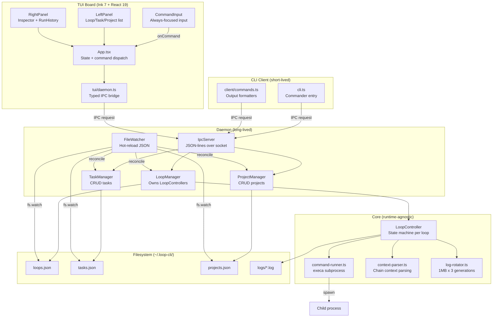
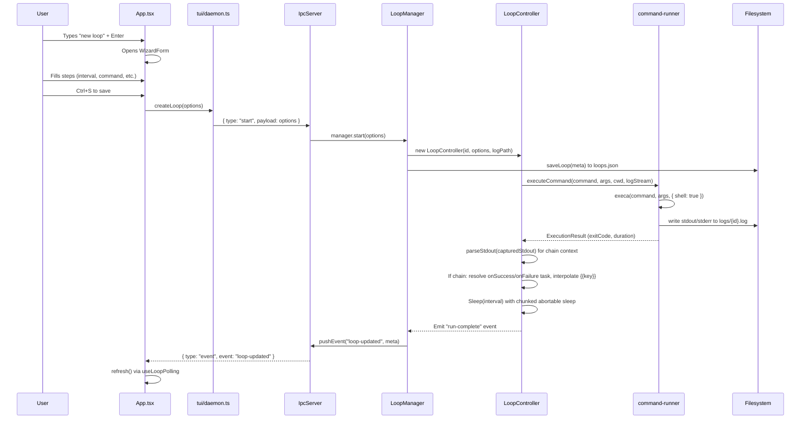
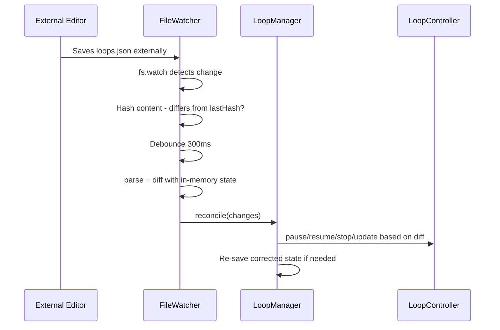

# Architecture

> Generated architecture reference for **loop-task** (repo: `loop-task`).
> Rerun `/ob-create-architecture` whenever the architecture changes significantly.
> Last updated: 2026-06-30.

## Architecture Overview

**loop-task** is a cross-platform command-line tool that repeatedly runs a shell
command at a human-readable interval (`30s`, `5m`, `1h`, `1d`, `1w`). It is built
for developers and automation/agent workflows that need lightweight, persistent,
recurring command execution without a full scheduler like cron.

The system uses a **client-daemon architecture** communicating over a **local IPC
transport** (Unix domain socket on POSIX, named pipe on Windows):

- A short-lived **CLI client** parses arguments and either runs a loop in the
  foreground or talks to a background daemon.
- A long-lived **background daemon** owns all managed loops, persists their state
  to disk, and streams their output to connected clients.
- An interactive **terminal UI board** (Ink 7 + React 19) is the primary way to
  create, inspect, and manage loops, driving the daemon entirely over IPC.

The architecture is deliberately **filesystem-backed and serverless** (no network
services, no database): all state lives under `~/.loop-cli`. The build step compiles
TypeScript to `dist/` for npm distribution; the board runs on Node >= 20 via `tsx` in dev.

Major architectural style: **multi-process, event-driven, message-passing** (JSON
lines over a socket), with a state-machine core per loop.

---

## 1. Project Structure

```text
loop-task/
├── src/
│   ├── cli.ts                  # Commander entry point (Node shebang); routes start/run/board
│   ├── entry.js                # Node entry wrapper (registers ESM loader, imports cli.js)
│   ├── esm-loader.js           # Custom Node ESM loader (fixes upstream extensionless imports)
│   ├── types.ts                # Shared domain + IPC message types (LoopOptions, LoopMeta, IpcRequest/Response)
│   ├── duration.ts             # Parse/format human intervals (uses `ms`)
│   ├── logger.ts               # Foreground logger (verbose/info/error)
│   ├── loop-config.ts          # buildLoopOptions, parseCommandLine, parseMaxRuns (validation)
│   │
│   ├── core/                   # Runtime-agnostic loop execution
│   │   ├── loop-controller.ts  # LoopController: per-loop state machine (EventEmitter)
│   │   ├── command-runner.ts   # executeCommand / executeCommandForeground (execa)
│   │   ├── context-parser.ts   # parseStdout: JSON/JSONL/plain-text -> chain context entries
│   │   ├── template.ts         # interpolate: {{key}} Mustache-style template substitution
│   │   ├── foreground-loop.ts  # runLoop: blocking foreground loop for `run`
│   │   ├── log-rotator.ts      # Size-based log rotation (1 MB x 3 generations)
│   │   ├── scheduling.ts       # computePhase / alignToPhase: spread scheduling via hash
│   │   └── log-parser.ts       # Log line classification (run headers, chain markers, exit codes)
│   │
│   ├── daemon/                 # Background server process
│   │   ├── index.ts            # Daemon entry: bind socket -> init manager -> handle signals
│   │   ├── server.ts           # IpcServer: net server, JSON-lines protocol, request routing
│   │   ├── http-server.ts      # HttpApiServer: REST + SSE HTTP server (localhost:8845)
│   │   ├── manager.ts          # LoopManager: owns LoopControllers, persistence, lifecycle
│   │   ├── spawner.ts          # ensureDaemon: spawn/restart daemon, code-signature check
│   │   ├── state.ts            # Loop + daemon state persistence, PID/signature, code signature
│   │   ├── file-watcher.ts     # Hot-reloading JSON configs (fs.watch + debounce + hash)
│   │   ├── task-manager.ts     # TaskManager: CRUD for task definitions
│   │   ├── projects.ts         # ProjectManager: CRUD for projects, default project
│   │   └── daemon-log.ts       # Daemon-side diagnostic log
│   │
│   ├── client/                 # CLI-side IPC consumer
│   │   ├── ipc.ts              # sendRequest / streamRequest (connect, timeout, framing)
│   │   └── commands.ts         # CLI output formatters (start/list/status/pause/.../logs/attach)
│   │
│   ├── tui/                    # Interactive TUI (Ink 7 + React 19)
│   │   ├── index.tsx           # launchBoard: Ink render(<App/>)
│   │   ├── App.tsx             # Top-level board container + state orchestration
│   │   ├── daemon.ts           # TUI -> daemon bridge (typed IPC calls)
│   │   ├── state.ts            # Re-exports from shared/ui/state (filters/sort logic)
│   │   ├── format.ts           # Re-exports from shared/ui/format (display formatters)
│   │   ├── types.ts            # View/Mode/TabName/PanelFocus/Command/CommandContext/ConfirmState
│   │   ├── router.ts           # useRouter hook (push/pop/replace navigation stack)
│   │   ├── commands.ts         # buildCommands/buildTabCommands (command registry, context-aware)
│   │   ├── theme.ts            # Dark/light theme tokens + statusColor() + tabAccentColor()
│   │   ├── components/         # CommandInput, LeftPanel, RightPanel, TabBar, Header,
│   │   │                       #   Navigator, Inspector, RunHistory, WizardForm, PatchEditForm,
│   │   │                       #   CommandsBrowserModal, DebugPanel, LogModal, Toast,
│   │   │                       #   CreateForm, TaskForm, TaskBrowser, ProjectsPage, Modal,
│   │   │                       #   FocusableInput, FocusableButton, FocusableList, etc.
│   │   └── hooks/              # useLoopPolling, useLogStream, useBreakpoint, useHoverState
│   │
│   ├── ipc/                    # Shared IPC primitives (server-side)
│   │   ├── send.ts             # send(): write a JSON line to a socket
│   │   └── handlers/
│   │       └── logs-stream.ts  # streamLogFollow: tail + fs.watch live log streaming
│   │
│   ├── shared/                 # Cross-cutting utilities
│   │   ├── fs-utils.ts         # writeFileAtomic (temp-then-rename), removeIfExists
│   │   ├── sleep.ts            # sleep(): abortable chunked sleep (SLEEP_CHUNK_MS)
│   │   ├── tail.ts             # tail(): last N lines of a string
│   │   ├── clipboard.ts        # copyToClipboard / readFromClipboard (cross-platform)
│   │   └── ui/                 # Shared UI utilities (format, state, hooks)
│   │       ├── format.ts           # Display formatters (describeLoop, statusLabel, commandLine, etc.)
│   │       ├── state.ts            # Filters/sort logic (applyLoopFilters, cycleSortMode, etc.)
│   │       └── hooks/              # useHoverState (shared UI hooks)
│   │
│   ├── config/
│   │   ├── constants.ts        # All magic numbers (POLL_MS, SLEEP_CHUNK_MS, MAX_LOG_BYTES, etc.)
│   │   └── paths.ts            # Filesystem paths under ~/.loop-cli/ (data dir, socket, PID, etc.)
│   │
│   ├── i18n/
│   │   ├── en.json             # All user-facing strings (490+ keys)
│   │   └── index.ts            # t(key, params?) function with Mustache interpolation
│
├── tests/                      # Vitest test files (*.test.ts)
├── openspec/                   # OpenSpec change management (proposals, specs, tasks)
├── .github/workflows/ci.yml    # GitHub Actions CI (typecheck -> lint -> test -> build, 3-OS matrix)
├── Dockerfile                  # Docker image (node:20-slim, volume mount ~/.loop-cli)
│
├── package.json                # pnpm, ESM, Node >= 20, Ink 7 + React 19
├── tsconfig.json               # TypeScript strict, ESNext, JSX react-jsx
├── tsconfig.build.json         # Build config (nodenext, outDir dist/)
├── vitest.config.ts            # Vitest 3, v8 coverage at 90% threshold
├── eslint.config.js            # ESLint 9 + typescript-eslint recommended
├── DESIGN.md                   # Design system: 4 primary colors + semantic + grays
└── ARCHITECTURE.md             # This file
```

---

## 2. High-Level System Diagram



---

## 3. Core Components

### 3.1 Frontend / User Interface (TUI)

**Name:** Ink TUI Board (`src/tui/`)

**Responsibility:** Interactive terminal UI for creating, inspecting, and managing loops, tasks, and projects. Command-first input model with fuzzy autocomplete.

**Key files:**
- `src/tui/App.tsx` - Root component: state orchestration, command dictionary dispatch, panel focus, Ctrl+Enter handling
- `src/tui/components/CommandInput.tsx` - Always-focused bottom input; three modes: command (autocomplete), confirm (yes/cancel), search (filter)
- `src/tui/components/LeftPanel.tsx` - 60% width; renders active tab's list (Navigator/TaskNavigator/ProjectsPage)
- `src/tui/components/RightPanel.tsx` - 40% width; renders Inspector + RunHistory
- `src/tui/components/TabBar.tsx` - Three-tab header (Loops/Tasks/Projects) with tab-specific accent colors
- `src/tui/components/WizardForm.tsx` - Multi-step create form (one field per screen, breadcrumb, Ctrl+S skip)
- `src/tui/components/PatchEditForm.tsx` - Inline patch-table edit (read-only values, `change <field>` targets a row)
- `src/tui/components/CommandsBrowserModal.tsx` - Ctrl+P command browser with search and grouped list
- `src/tui/commands.ts` - `buildCommands(context)` + `buildTabCommands(context)` - context-aware command registry
- `src/tui/router.ts` - `useRouter("board")` stack-based navigation (push/pop/replace)
- `src/tui/theme.ts` - 4 primary colors (brand/loop/task/project) + 4 semantic + grays

**Technologies:** Ink 7.1.0, React 19, ink-combobox 0.2.0, ink-scroll-list 0.4.1, ink-spinner 5.0.0, ink-text-input 6.0.0, ink-select-input 6.2.0

**Inputs:** Keystrokes (keyboard only, no mouse). **Outputs:** Terminal rendering via Ink, IPC requests via `tui/daemon.ts`.

### 3.2 Backend / Daemon

**Name:** Background Daemon (`src/daemon/`)

**Responsibility:** Long-lived process that owns all LoopControllers, manages persistence, handles IPC requests, and streams logs to connected clients.

**Key files:**
- `src/daemon/index.ts` - Entry: bind socket -> init managers -> handle signals -> start file watcher
- `src/daemon/server.ts` - `IpcServer`: TCP server over Unix socket/named pipe, JSON-lines protocol, request routing, subscriber set for push events
- `src/daemon/manager.ts` - `LoopManager`: owns `_loops: Map<string, StoredLoop>`, reconciles from disk, handles start/pause/resume/stop/trigger/delete
- `src/daemon/spawner.ts` - `ensureDaemon()`: spawn daemon as child process, code-signature verification, alive check
- `src/daemon/state.ts` - Persistence: `loadAllLoops()`, `saveLoop()`, `writeFileAtomic()`, PID/signature files, migration from old directory format
- `src/daemon/file-watcher.ts` - `FileWatcher`: fs.watch + debounce + SHA-1 hash to detect external changes vs self-writes; mtime polling fallback for Windows
- `src/daemon/task-manager.ts` - `TaskManager`: in-memory Map, CRUD operations, persists to tasks.json
- `src/daemon/projects.ts` - `ProjectManager`: CRUD for projects, default project is permanent, 6 available colors

**Technologies:** Node.js net module (TCP server), fs (file I/O), execa (child process spawning via LoopController)

**Inputs:** IPC requests over socket. **Outputs:** IPC responses, push events to subscribers, filesystem writes.

### 3.3 Shared Libraries / Common Code

**Name:** Core runtime (`src/core/`) + Shared utilities (`src/shared/`)

**Key files:**
- `src/core/loop-controller.ts` - `LoopController extends EventEmitter`: per-loop state machine. States: running/waiting/paused/stopped. Chunked abortable sleep. Chain execution with context passing.
- `src/core/command-runner.ts` - `executeCommand()`: execa subprocess, stdout capture for chain context, log streaming
- `src/core/context-parser.ts` - `parseStdout()`: JSON/JSONL/plain-text -> key-value context for chain interpolation
- `src/core/template.ts` - `interpolate()`: `{{key}}` Mustache substitution
- `src/core/log-rotator.ts` - `rotateLogIfNeeded()`: size-based rotation (1 MB x 3 generations)
- `src/core/scheduling.ts` - `computePhase()`: deterministic spread via `hash(loopId) % interval`
- `src/core/foreground-loop.ts` - `runLoop()`: blocking foreground loop for `loop-task run`
- `src/shared/fs-utils.ts` - `writeFileAtomic()`: temp-then-rename for crash-safe writes
- `src/shared/sleep.ts` - `sleep()`: abortable sleep with `SLEEP_CHUNK_MS` (200ms) for responsive pause/resume
- `src/shared/clipboard.ts` - Cross-platform clipboard (clip/pbcopy/xclip)
- `src/shared/tail.ts` - `tail()`: last N lines of a string

**Constraint:** `src/core/` must NOT import from `src/daemon/` or `src/tui/` - it is runtime-agnostic.

### 3.4 CLI / Scripts / Automation

**Name:** CLI Client (`src/cli.ts`, `src/client/`)

**Responsibility:** Commander-based CLI with subcommands: `start`, `stop`, `restart`, `new` (deprecated), `run`, `board` (default), `status [--json]`, `export`, `import`, `project *`.

**Key files:**
- `src/cli.ts` - Commander program definition, routes to client/commands or daemon/spawner
- `src/client/ipc.ts` - `sendRequest()`: connect to socket, send JSON line, parse response, 10s timeout. `streamRequest()`: for log streaming.
- `src/client/commands.ts` - CLI output formatters: `startLoop`, `listLoops`, `showStatus`, `pauseLoop`, etc.

**Technologies:** Commander 13, execa 9

---

## 4. Data Flow

### Main Runtime Flow: Create and Run a Loop



### Hot-Reload Flow



---

## 5. Data Stores

All persistence is filesystem-based under `~/.loop-cli/` (overridable via `LOOP_CLI_HOME`):

| Store | File | Format | Schema | Migration |
|-------|------|--------|--------|-----------|
| Loops | `loops.json` | JSON array | `LoopMeta[]` | Migrates from old `loops/` directory if JSON doesn't exist |
| Tasks | `tasks.json` | JSON array | `TaskDefinition[]` | Migrates from old `tasks/` directory |
| Projects | `projects.json` | JSON array | `Project[]` | Default project created on first init |
| Logs | `logs/{id}.log` | Plain text | Append-only with run headers | Rotated at 1 MB x 3 generations |
| Daemon PID | `daemon.pid` | Plain text | Process ID | Recreated on each daemon start |
| Code signature | `daemon.sig` | Plain text | SHA-1 hash | Recreated on each daemon start |

**Write strategy:** All state writes use `writeFileAtomic()` (temp-then-rename) for crash safety. Synchronous to preserve immediate-disk-state-on-pause semantics.

**No schema versioning:** Future `LoopMeta` shape changes risk breaking persisted JSON. Corrupted files are silently skipped.

**Chain context is ephemeral:** In-memory only per loop iteration. Never persisted to disk or exposed via IPC.

---

## 6. External Integrations / APIs

| Integration | Method | Config | Auth | Failure Behavior |
|---|---|---|---|---|
| Child processes (loops) | `execa` spawn with `shell: true` | `cwd` per loop | Inherits daemon's process env | Exit code captured, logged, chain may branch to onFailure |
| Clipboard | `execFileSync` (clip/pbcopy/xclip) | None | None | Silently catches errors |
| HTTP API | `node:http` server on `127.0.0.1:8845` | `LOOP_CLI_HTTP_PORT` env var | None (localhost-only) | If port in use, HTTP API skipped — IPC still works |
| Locale/i18n | `src/i18n/en.json` (single file) | Hard-coded `en` | N/A | `t(key)` returns key if missing |

The daemon listens on a local socket (IPC) and optionally on an HTTP port (`127.0.0.1:8845`) for REST/SSE API access. The HTTP server shares the same manager instances as IPC — it is a transport adapter, not a separate system. Swagger UI is available at `/api/docs`, OpenAPI spec at `/api/openapi.json`.

---

## 7. Key Technologies

| Technology | Version | Architectural Role |
|---|---|---|
| TypeScript | 5.8 (strict) | All source code; ESM only (`"type": "module"`) |
| Node.js | >= 20 | Runtime for CLI, daemon, and TUI |
| React | 19.2 | TUI rendering (via Ink) |
| Ink | 7.1.0 | React renderer for terminal (replaced OpenTUI) |
| ink-combobox | 0.2.0 | Fuzzy-match command input with headless hooks |
| ink-scroll-list | 0.4.1 | Virtualized list rendering for Navigator/RunHistory |
| ink-spinner | 5.0.0 | Animated spinner for running loops |
| ink-text-input | 6.0.0 | Text input with cursor for FocusableInput |
| ink-select-input | 6.2.0 | Select input (installed, minimal usage) |
| Commander | 13.1.0 | CLI argument parsing |
| execa | 9.6.0 | Child process spawning for loop commands |
| ms | 2.1.3 | Parse/format human-readable durations (`30m`, `1h`) |
| Vitest | 3.1.0 | Test framework with v8 coverage |
| ink-testing-library | 4.0.0 | Ink component testing (`render`, `lastFrame`, `stdin.write`) |
| ESLint | 9.25.0 | Linting with typescript-eslint recommended |
| tsx | 4.19.0 | Dev runner (replaces Bun) |

---

## 8. Deployment & Infrastructure

### Build

```
pnpm run build
# = tsc -p tsconfig.build.json + copy entry.js/esm-loader.js to dist/
```

Output: `dist/` directory with compiled `.js` files. `bin` field points at `dist/entry.js`.

### Docker

```dockerfile
FROM node:20-slim
# Installs loop-task, mounts ~/.loop-cli as volume
docker run -it -v ~/.loop-cli:/root/.loop-cli loop-task
```

### CI/CD (GitHub Actions)

`.github/workflows/ci.yml` runs on push to `main` and `feature/v2.0.0`, pull requests to `main`:
- Matrix: ubuntu-latest, macos-latest, windows-latest (Node 20, pnpm v11)
- Steps: typecheck -> lint -> test -> build

### Distribution

Published to npm as `loop-task`. Version: 2.0.0.

### Environment

- `LOOP_CLI_HOME` - Override data directory (default: `~/.loop-cli`)
- No other env vars required

---

## 9. Security Architecture

| Aspect | Approach |
|---|---|
| Trust boundary | Local machine/user only. No network listener. |
| Authentication | None. Daemon trusts local socket connections. |
| Secrets | No secrets handling. Loop metadata and logs are plain files. Never read or output `.env` files. |
| Input validation | Duration parsing (`parseDuration`), max-runs (`parseMaxRuns`), command emptiness, quote balancing (`parseCommandLine`) in `loop-config.ts` |
| IPC robustness | Malformed JSON requests answered with error response, not crash |
| Child process isolation | Child processes inherit daemon's environment, run in specified `cwd`, communicate via stdout/stderr pipes |

---

## 10. Monitoring & Observability

| Aspect | Implementation |
|---|---|
| Daemon log | `src/daemon/daemon-log.ts` - writes to `~/.loop-cli/daemon.log` |
| Loop logs | Per-loop log files at `~/.loop-cli/logs/{id}.log` with run headers, chain markers, exit codes |
| Log rotation | 1 MB max per file, 3 generations (`.{1}`, `.{2}`, `.{3}`) |
| TUI polling | `useLoopPolling` hook polls daemon every 1000ms (`POLL_MS`) |
| Push events | Daemon `pushEvent()` to subscribed TUI clients (e.g., "loop-updated") |
| TUI toasts | `useToasts` hook shows auto-dismissing (3.5s) success/error/info notifications |
| Debug panel | Toggleable DebugPanel showing last 12 keypresses with modifier flags |

No metrics, tracing, or error reporting beyond local logs.

---

## 11. Performance & Scalability

| Aspect | Approach |
|---|---|
| Sleep architecture | Chunked abortable sleep (`SLEEP_CHUNK_MS = 200ms`) allows responsive pause/resume/trigger without busy-wait |
| Spread scheduling | `computePhase(loopId, intervalMs) = hash(loopId) % intervalMs` distributes loop start times across an interval to avoid thundering herd |
| Log rotation | Caps disk usage at 1 MB x 3 generations per loop |
| Stdout capture | Caps at `MAX_CONTEXT_STDOUT_BYTES` (1 MB) per run for chain context |
| TUI rendering | Ink re-renders on state change; `useMemo` for filtered/sorted loop lists |
| Known bottleneck | `POLL_MS = 1000ms` polling interval for TUI refresh; push events mitigate but polling is the fallback |

---

## 12. Development Workflow

### Setup

```bash
git clone <repo>
cd loop-task
pnpm install
```

### Commands

| Command | Purpose |
|---|---|
| `pnpm run dev` | Run app from source via `tsx src/cli.ts` |
| `pnpm run dev:watch` | Run with file watching (`tsx --watch`) |
| `pnpm run typecheck` | `tsc --noEmit` |
| `pnpm run lint` | `eslint src/ tests/` |
| `pnpm run test` | `vitest run` (excludes `background-cli.test.ts`) |
| `pnpm run test:coverage` | `vitest run --coverage` (90% threshold) |
| `pnpm run build` | `tsc -p tsconfig.build.json` + copy entry.js/esm-loader.js |
| `pnpm run release:dry` | `npm publish --dry-run` |
| `pnpm run release` | `npm publish` |

### Gate order

`typecheck` -> `lint` -> `test` -> `build` - always run all four before claiming done.

### RTK

All shell commands must be prefixed with `rtk` in agent contexts (see AGENTS.md).

---

## 13. Testing Strategy

| Aspect | Details |
|---|---|
| Framework | Vitest 3 with `globals: true` |
| Location | `tests/` directory, `*.test.ts` for logic, `*.test.tsx` for Ink components |
| Coverage | v8 provider, 90% thresholds (lines/functions/branches/statements) |
| Coverage excludes | `src/cli.ts`, `src/types.ts`, `src/daemon/index.ts`, `src/tui/**` |
| Known issues | `tests/cli.test.ts` has pre-existing failures (version assertion, `--description` flag requirement). `tests/loop-controller.test.ts` has timer mock issues. `tests/projects.test.ts` has test-dir cleanup issues. |
| TUI testing | TUI components tested with `ink-testing-library` (`render()`, `lastFrame()`, `stdin.write()`). Component tests in `tests/*.test.tsx`. Coverage excludes `src/tui/**` but new/changed components should ship with a `.test.tsx`. |
| TUI testing rules | Wrap absolute/100% layouts in a sized `<Box>`; type chars one-at-a-time with `await delay()` between them; `await` after `stdin.write()` for async key handling (esc, ctrl combos). |
| Test isolation | Use `LOOP_CLI_HOME` to isolate daemon state |

---

## 14. Architectural Decisions & Rationale

| Decision | Rationale | Evidence |
|---|---|---|
| Ink 7 over OpenTUI | OpenTUI's `useKeyboard` has stale closure bugs; Ink's `useInput` re-registers every render | `src/tui/` replaces `src/board/`; package.json drops `@opentui/*`; board deleted |
| Command-first input | Replaces 13+ Tab stops with a single always-focused command palette; all actions discoverable via fuzzy autocomplete | `CommandInput.tsx`, `commands.ts` registry |
| Dictionary dispatch | `Record<string, () => void>` instead of `switch/case` for command handling | `App.tsx` `commandHandlers` object; project-guardrails rule |
| Filesystem over database | No database dependency; atomic JSON writes via temp-then-rename; simple backup/inspect | `shared/fs-utils.ts`, `daemon/state.ts` |
| Client-daemon over embedded | Short-lived CLI client avoids owning background state; daemon owns loops lifecycle | IPC protocol in `types.ts`, `daemon/server.ts` |
| Chunked sleep | Allows responsive pause/resume/trigger without busy-wait | `SLEEP_CHUNK_MS = 200` in `constants.ts`, `shared/sleep.ts` |
| Hot-reload with hash detection | Prevents infinite self-write loops; detects external changes reliably | `daemon/file-watcher.ts` SHA-1 hashing + debounce |
| 4 primary colors | brand (amber), loop (blue), task (purple), project (green) + 4 semantic; no decorative colors | `theme.ts`, `DESIGN.md` |
| Ctrl+Enter detection via `input.includes("\n")` | VS Code terminal sends `\r\n` for Ctrl+Enter with all flags zero; `input.length === 1` guard prevents newline injection | `App.tsx` global `useInput` |

---

## 15. Constraints, Risks, and Technical Debt

| Risk/Debt | Impact | Mitigation |
|---|---|---|
| `src/board/` stale code | Confusion; 70+ files kept for reference but not compiled/used | **Deleted** in refactor; shared code extracted to `src/shared/ui/` |
| No schema versioning | Future `LoopMeta` shape changes risk breaking persisted JSON | Corrupted files silently skipped; no migration path |
| Pre-existing test failures | 11 tests fail on `main` before any changes; coverage gate may be unreliable | Confirm failures are pre-existing before touching assertions |
| `ink-combobox` is young | v0.2.0, 0 stars, single contributor | Headless hooks isolate us from breaking changes; MIT, small package, can fork if needed |
| Coverage excludes `src/tui/**` | TUI has no automated tests | Component tests with `ink-testing-library` in `tests/*.test.tsx`; DebugPanel for key debugging |
| `POLL_MS = 1000ms` | 1-second latency between daemon state change and TUI update | Push events mitigate for subscribed clients |
| Windows IPC differences | Named pipes vs Unix sockets; Ctrl+Enter encoding differs | `input.includes("\n")` detection; `file-watcher.ts` mtime polling fallback |

---

## 16. Future Considerations

**Documented roadmap:**
- Merge `feature/v2.0.0` to `main` and publish v2.0.0 to npm
- Integrate `ContextHelpModal` content into the command system
- Wire remaining stub commands: `api`, `status`, `export`, `import`
- Wire `ProjectsPage` into LeftPanel tab content (currently shows placeholder text)

**Recommendations (not yet documented):**
- ~~Delete `src/board/` directory entirely to eliminate confusion~~ DONE
- Add schema versioning to JSON files for safe migrations
- Add integration tests for TUI components using `ink-testing-library` (done - `tests/tui-components.test.tsx`)
- Replace polling with push-event-only updates (reduce `POLL_MS` or eliminate)
- Consider `error` event handling for push events when subscriber sockets die

---

## 17. Project Identification

| Field | Value |
|---|---|
| Name | `loop-task` |
| Repository | `loop-task` (https://github.com/CKGrafico/loop-task) |
| Package name | `loop-task` on npm |
| Language | TypeScript 5.8 (strict, ESM) |
| Type | CLI tool + TUI + background daemon |
| Runtime | Node.js >= 20 |
| Version | 2.0.0 |
| Date of review | 2026-06-30 |
| Maintainer | Quique Fdez Guerra |

---

## 18. Glossary / Acronyms

| Term | Definition |
|---|---|
| Loop | A scheduled recurring execution of a command on an interval. Has a `LoopController` and a `LoopMeta` state. |
| Task | A reusable command definition with optional success/failure chains. Referenced by loops via `taskId`. |
| Project | An organizational scope for loops. Has a color. Default project is permanent and cannot be deleted. |
| Chain | A sequence of tasks where one task's output becomes the next task's input via `{{key}}` interpolation. |
| Chain Context | Ephemeral key-value store from stdout of previous task in a chain. Parsed as JSON, JSONL, or plain text. |
| Daemon | The long-lived background process that owns all LoopControllers and persists state. |
| IPC | Inter-process communication over Unix socket (POSIX) or named pipe (Windows). JSON-lines protocol. |
| Hot-reload | External changes to `loops.json`/`tasks.json`/`projects.json` detected via `fs.watch` + hash comparison and reconciled into the running daemon. |
| Spread scheduling | Distributing loop start times across an interval using `hash(loopId) % intervalMs` to avoid thundering herd. |
| Code signature | SHA-1 hash of the compiled dist/ files used to detect when the CLI binary changes and the daemon needs restarting. |
| Tab | One of three content tabs in the TUI: Loops, Tasks, Projects. Determined by `activeTab` state, not router. |
| Panel focus | Which panel (left or right) receives arrow-key input. Toggled via Tab/Shift+Tab. Not Ink's `useFocus()`. |
| Command palette | The always-focused bottom input where users type commands with fuzzy autocomplete via `ink-combobox`. |
| Wizard form | Multi-step create form: one field per screen, breadcrumb progress, Ctrl+S to skip optional steps. |
| Patch edit | Inline edit form: read-only table of all field values, `change <field>` command targets individual rows. |
